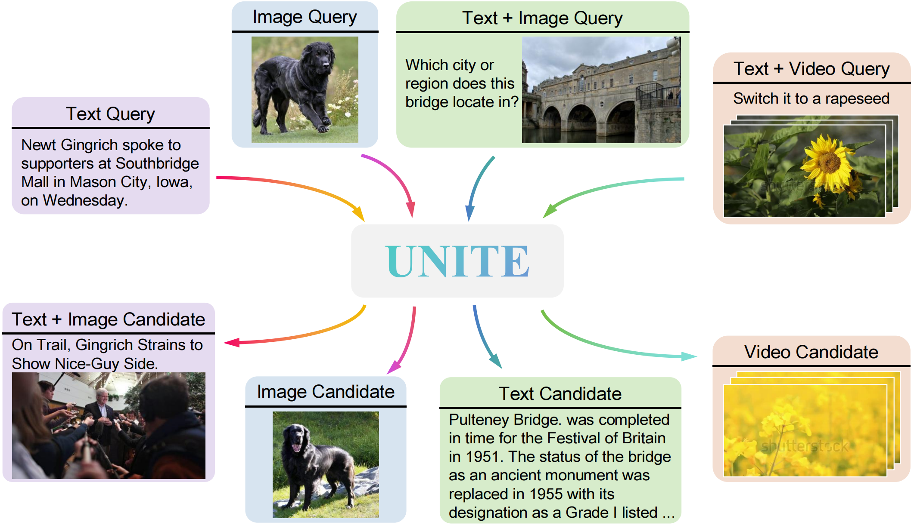
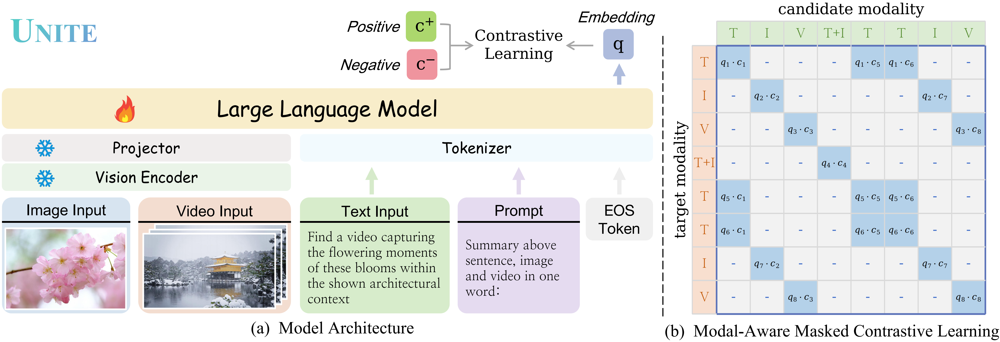
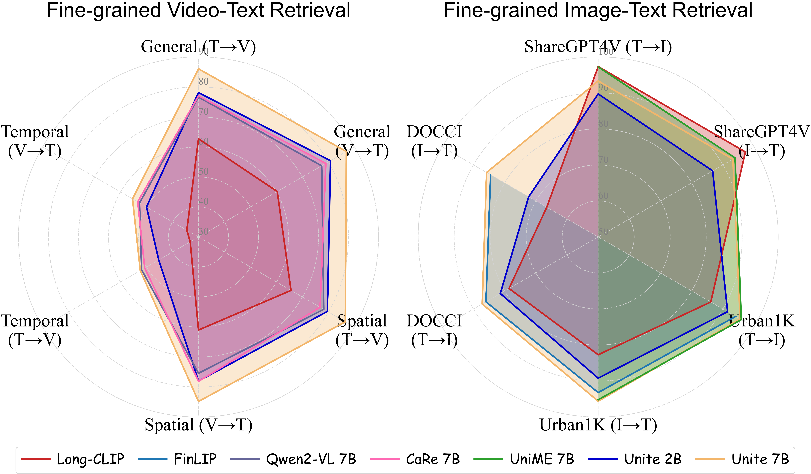
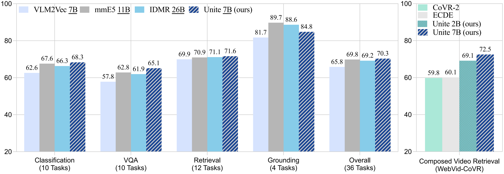

# Modality Curation: Building Universal Embeddings for Advanced Multimodal Information Retrieval

[](https://arxiv.org/pdf/2505.19650) [](https://friedrichor.github.io/projects/UNITE) [](https://huggingface.co/collections/friedrichor/unite-682da30c4540abccd3da3a6b) [](https://huggingface.co/collections/friedrichor/unite-682da30c4540abccd3da3a6b)

</div>

## 🔥 News

- [2025/06/05] We update our inference code, both on github and huggingface.
- [2025/06/01] We release our training code and inference code.
- [2025/05/28] We release our models and training datasets to [HuggingFace](https://huggingface.co/collections/friedrichor/unite-682da30c4540abccd3da3a6b).
- [2025/05/26] We release our paper: [Modality Curation: Building Universal Embeddings for Advanced Multimodal Information Retrieval](https://arxiv.org/abs/2505.19650)

## 🛰️ Release Plan

- [X] Paper
- [X] Models, Datasets
- [X] Inference code
- [X] Training code
- [ ] Evaluation code

## 👀 Overall

<p align="center">
    
    <br>
    Universal multimodal embedder, <strong>UNITE</strong>, allows for a unified representation of arbitrary multimodal contents.
</p>

## 🔭 UNITE

<p align="center">
    
    <br>
    Overview of <strong>UNITE</strong>,: (a) Model architecture utilizing LMM as the backbone, supporting multimodal inputs (text, images, videos, and their combinations). (b) Similarity matrix after applying MAMCL, which enables focused contrastive learning by restricting comparisons to samples sharing the same target modality, thus reducing inter-modal interference.
</p>

## 🏆 Performance

<p align="center">
    
    <br>
    Performance comparison on fine-grained video-text benchmark (CaReBench) and image-text benchmarks (ShareGPT4V, Urban1K, DOCCI).
</p>
<p align="center">
    
    <br>
    Performance comparison on instruction-based retrieval benchmarks (left: MMEB and right: WebVid-CoVR).
</p>

## 📷 Visualization Results

<p align="center">
    
</p>

## 🚀 Quick Start

### Installation

```
conda create -n unite python=3.10 -y
conda activate unite

pip install torch==2.5.0 torchvision==0.20.0 torchaudio==2.5.0
pip install flash-attn --no-build-isolation
pip install -r requirements.txt
```

### Data Preparation

- Retrieval Adaptation: [Unite-Base-Retrieval-Train](https://huggingface.co/datasets/friedrichor/Unite-Base-Retrieval-Train)  
Please download the raw videos of `Tarsier2-Recap-585K` from [omni-research/Tarsier2-Recap-585](https://huggingface.co/datasets/omni-research/Tarsier2-Recap-585K), refer to [here](https://huggingface.co/datasets/friedrichor/Unite-Base-Retrieval-Train/blob/main/Tarsier2-Recap-585K/README.md).

- Instruction Tuning: [Unite-Instruct-Retrieval-Train](https://huggingface.co/datasets/friedrichor/Unite-Instruct-Retrieval-Train)  
Please download the raw images of `MMEB-train` from [TIGER-Lab/MMEB-train](https://huggingface.co/datasets/TIGER-Lab/MMEB-train), refer to [here](https://huggingface.co/datasets/friedrichor/Unite-Instruct-Retrieval-Train/blob/main/MMEB-train/README.md).


### Training

For single-gpu or multi-gpu settings, you can utilize the following training scripts:
```bash
bash scripts/multi_gpu/qwen2_vl_2b/stage1_adaptation.sh
bash scripts/multi_gpu/qwen2_vl_2b/stage2_instrcution.sh
```

For multi-node settings, you can utilize the following training scripts:
```bash
bash scripts/multi_node/qwen2_vl_2b/stage1_adaptation.sh
bash scripts/multi_node/qwen2_vl_2b/stage2_instrcution.sh
```

### Inference

You can get the simplest inference code from [Huggingface QuickStart](https://huggingface.co/friedrichor/Unite-Base-Qwen2-VL-2B#quickstart), or run the following command.

```
cd inference
python inference_demo.py
```

## 🙇 Acknowledgments

The codebase of UNITE is adapted from [LLaVA-NeXT](https://github.com/LLaVA-VL/LLaVA-NeXT) and [FastChat](https://github.com/lm-sys/FastChat). We are also grateful for the following projects our UNITE arise from:
- [GME](https://github.com/BIGBALLON/GME-Search), [LamRA](https://github.com/Code-kunkun/LamRA), [VLM2Vec](https://github.com/TIGER-AI-Lab/VLM2Vec), [E5-V](https://github.com/kongds/E5-V)
- [Qwen2-VL](https://github.com/QwenLM/Qwen2.5-VL), [InternVideo2](https://github.com/OpenGVLab/InternVideo)
- [BEIR](https://huggingface.co/BeIR), [sentence-transformers](https://huggingface.co/sentence-transformers), [img2dataset](https://github.com/rom1504/img2dataset)

## 📋 Citation

If you find our work helpful, feel free to give us a cite.

```
@article{kong2025modality,
  title={Modality Curation: Building Universal Embeddings for Advanced Multimodal Information Retrieval},
  author={Kong, Fanheng and Zhang, Jingyuan and Liu, Yahui and Zhang, Hongzhi and Feng, Shi and Yang, Xiaocui and Wang, Daling and Tian, Yu and W., Victoria and Zhang, Fuzheng and Zhou, Guorui},
  journal={arXiv preprint arXiv:2505.19650},
  year={2025}
}
```
