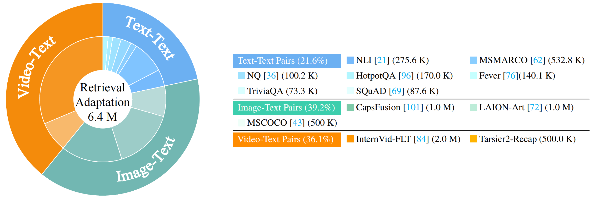
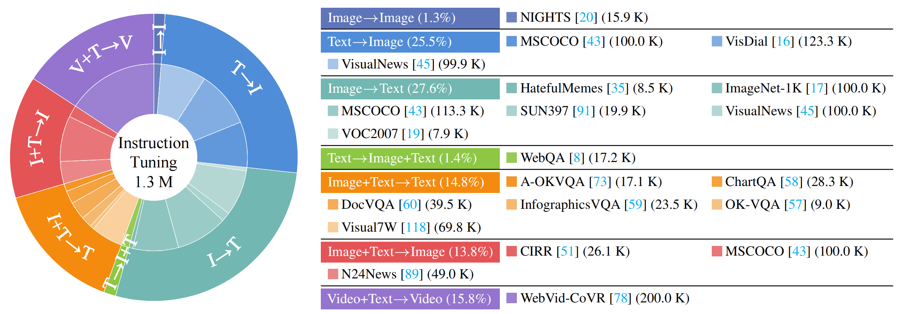

# Modality Curation: Building Universal Embeddings for Advanced Multimodal Information Retrieval

[](https://arxiv.org/pdf/2505.19650) [](https://friedrichor.github.io/projects/UNITE) [](https://huggingface.co/collections/friedrichor/unite-682da30c4540abccd3da3a6b) [](https://huggingface.co/collections/friedrichor/unite-682da30c4540abccd3da3a6b)

</div>

## 🔥 News

- [2025/05/26] We release our paper: [Modality Curation: Building Universal Embeddings for Advanced Multimodal Information Retrieval](https://arxiv.org/abs/2505.19650)

## Release Plan

- [X] Paper
- [X] Models, Datasets
- [ ] Inference code
- [ ] Evaluation code
- [ ] Training code

## 👀 Overall

<p align="center">
    
    <br>
    We develop a universal multimodal embedder <strong>UNITE</strong>, allowing for a unified representation of arbitrary multimodal contents.
</p>

## 🔭 UNITE

<p align="center">
    
    <br>
    Overview of <strong>UNITE</strong>,: (a) Model architecture utilizing LMM as the backbone, supporting multimodal inputs (text, images, videos, and their combinations). (b) Similarity matrix after applying MAMCL, which enables focused contrastive learning by restricting comparisons to samples sharing the same target modality, thus reducing inter-modal interference.
</p>

## 🔍 Dataset

<p align="center">
    
</p>
<p align="center">
    
</p>

## 🏆 Performance

<p align="center">
    
    <br>
    Performance comparison on fine-grained video-text benchmark (CaReBench) and image-text benchmarks (ShareGPT4V, Urban1K, DOCCI). Our UNITE achieves the overall optimal performance.
</p>
<p align="center">
    
    <br>
    Performance comparison on instruction-based retrieval benchmarks (left: MMEB and right: WebVid-CoVR). Our UNITE achieves leading performance on various tasks, even surpassing models with larger parameter scales.
</p>

## 📋 Citation

If you find our work helpful, feel free to give us a cite.

```
@article{kong2025modality,
  title={Modality Curation: Building Universal Embeddings for Advanced Multimodal Information Retrieval},
  author={Kong, Fanheng and Zhang, Jingyuan and Liu, Yahui and Zhang, Hongzhi and Liu, Yahui and Feng, Shi and Yang, Xiaocui and Wang, Daling and Tian, Yu and and W., Victoria and Zhang, Fuzheng and Zhou, Guorui},
  journal={arXiv preprint arXiv:2505.19650},
  year={2025}
}
```